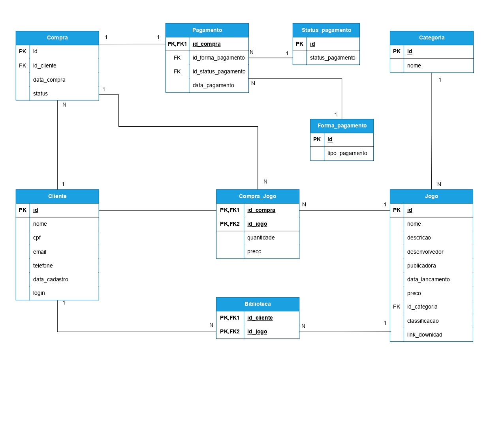

# 🎮 Plataforma de Venda e Gerenciamento de Jogos Digitais

> **Status do Projeto:** 🚧 *Em desenvolvimento (atualmente no RF05)*

---

## 🧾 Descrição Geral

O sistema proposto é uma plataforma de **venda e gerenciamento de jogos digitais**, desenvolvida em **Java com Spring Boot**.  
O objetivo é oferecer aos clientes uma experiência completa de **compra, download e gerenciamento** de seus jogos adquiridos.

A aplicação permitirá:
- Cadastro e autenticação de clientes;
- Registro e controle dos jogos disponíveis;
- Processamento de compras e pagamentos;
- Criação de uma biblioteca digital pessoal com downloads ilimitados.

O sistema também gerenciará informações detalhadas sobre cada jogo, incluindo:
- Nome
- Descrição
- Desenvolvedor
- Publicadora
- Data de lançamento
- Preço
- Categoria
- Classificação indicativa
- Link de download

As transações de compra poderão conter múltiplos jogos e estarão vinculadas a um único pagamento.

---

## 📋 Requisitos Funcionais

| Código | Descrição | Status |
|--------|------------|--------|
| **RF01** | O sistema deve permitir o cadastro de clientes | ✅ Concluído |
| **RF02** | O sistema deve permitir a atualização dos dados cadastrais do cliente | ✅ Concluído |
| **RF03** | O sistema deve permitir a autenticação de clientes (login) para acesso à conta | 🚧 Em desenvolvimento |
| **RF04** | O sistema deve armazenar informações sobre os jogos disponíveis para venda | ✅ Concluído |
| **RF05** | O sistema deve permitir a inclusão, atualização e exclusão de jogos da plataforma | ✅ Concluído |


---

## 🏗️ Tecnologias Utilizadas

- ☕ **Java 17**
- 🌱 **Spring Boot 3**
- 🧩 **Spring Data JPA**
- 🧾 **PostgreSQL**
- 🔐 **Spring Security + JWT**
- 🧰 **Maven**
- 🧪 **JUnit / Mockito** *(planejado)*

---

## 🗂️ Modelagem de Dados

A modelagem do banco de dados foi criada com base nos requisitos funcionais.  
Ela representa as principais entidades do sistema.



---

## ⚙️ Como Executar o Projeto

1. **Clonar o repositório**
   ```bash
   git clone https://github.com/GuilhermeSaar/nome-do-projeto.git
